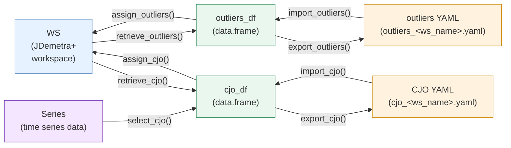

<!-- README.md is generated from README.Rmd. Please edit that file -->

```{r, echo = FALSE}
knitr::opts_chunk$set(
    collapse = TRUE,
    comment = "#>",
    fig.path = "man/figures/README-",
    fig.align = "center",
    fig.width = 8L
)
library("rjd3production")
```

# {rjd3production}

<!-- badges: start -->
[](https://CRAN.R-project.org/package=rjd3production)

[](https://github.com/TanguyBarthelemy/rjd3production/actions/workflows/R-CMD-check.yaml)
[](https://github.com/TanguyBarthelemy/rjd3production/actions/workflows/lint.yaml)

[](https://github.com/TanguyBarthelemy/rjd3production/actions/workflows/pkgdown.yaml)
<!-- badges: end -->


<div align = center>
  
## [🇫🇷 README en français](#présentation) \| [🇬🇧 README in english](#overview)

</div>


### Présentation

**{rjd3production}** aide les producteurs de données CVS CJO à mettre en place des chaînes de production.

Il permet notamment de :

- Créer des calendriers français et régresseurs de calendrier compatibles JDemetra+
- Identifier des SAI par leur nom
- Selectionner les jeux de calendrier pour une ou plusieurs séries
- Manipuler les régresseurs de calendrier et les outliers d'un Workspace selon la dynamique suivante:

    * Les fonctions `import_XXX()` et `export_XXX()` permettent de convertir les data.frame contenant les outliers et régresseurs de calendrier en fichiers et inversement
    * Les fonctions `retrieve_XXX()` et `assign_XXX()` permettent d'extraire (resp. d'assigner) les outliers et régresseurs de calendrier d'un workspace




## Installation

**{rjd3production}** s'appuie sur le paquetage [**{rJava}**](https://CRAN.R-project.org/package=rJava) 

L'exécution des paquets rjd3 nécessite **Java 17 ou plus**. La manière de mettre en place une telle configuration dans R est expliquée [ici](https://jdemetra-new-documentation.netlify.app/#Rconfig)


### Latest release

Pour obtenir la version stable actuelle (à partir de la dernière version) :

- Depuis GitHub :

``{r, echo = TRUE, eval = FALSE}
# install.packages("remotes")
remotes::install_github("TanguyBarthelemy/rjd3production@*release")
````

- De [r-universe](https://TanguyBarthelemy.r-universe.dev/rjd3production) :

``{r, echo = TRUE, eval = FALSE}
install.packages("rjd3production", repos = c("https://TanguyBarthelemy.r-universe.dev", "https://cloud.r-project.org"))
````

### Version de développement

Vous pouvez installer la version de développement de **{rjd3production}** depuis [GitHub] (https://github.com/) avec :

```{r, echo = TRUE, eval = FALSE}
# install.packages("remotes")
remotes::install_github("TanguyBarthelemy/rjd3production")
```


<!-- ### Usage -->

<!-- #### Chargement du package -->

<!-- ```{r fr-loading-rjd3production, eval = TRUE} -->
<!-- library("rjd3production") -->
<!-- ``` -->


### Overview

**{rjd3production}** helps producers of CVS CJO data to set up production lines.

In particular, it enables you to:

- Create JDemetra+-compatible French calendars and calendar regressors
- Identify SAIs by name
- Select calendar sets for one or more series
- Manipulate Workspace calendar regressors and outliers according to the following dynamics:

    * The `import_XXX()` and `export_XXX()` functions convert data.frames containing calendar outliers and regressors into files, and vice versa.
    * The `retrieve_XXX()` and `assign_XXX()` functions extract (resp. assign) calendar outliers and regressors from a workspace.


### Installation

To get the current stable version (from the latest release):

- From GitHub:

```{r, echo = TRUE, eval = FALSE}
# install.packages("remotes")
remotes::install_github("TanguyBarthelemy/rjd3production@*release")
```

- From [r-universe](https://TanguyBarthelemy.r-universe.dev/rjd3production):

```{r, echo = TRUE, eval = FALSE}
install.packages("rjd3production", repos = c("https://TanguyBarthelemy.r-universe.dev", "https://cloud.r-project.org"))
```

### Development version

You can install the development version of **{rjd3production}** from [GitHub](https://github.com/) with:

```{r, echo = TRUE, eval = FALSE}
# install.packages("remotes")
remotes::install_github("TanguyBarthelemy/rjd3production")
```


<!-- ### Usage -->

<!-- #### Loading the package -->

<!-- ```{r en-loading-rjd3production, eval = TRUE} -->
<!-- library("rjd3production") -->
<!-- ``` -->

